# Awesome Jetbrains
A collection of awesome Fonts and Color Schemes to be used in Jetbrains IDEs.

These are some color schemes and fonts I prefer to use in my IDEs. All the color schemes are fully compatible with -
* [PyCharm](http://jetbrains.com/pycharm)  
* [WebStorm](http://jetbrains.com/webstorm)  
* [PhpStorm](http://jetbrains.com/phpstorm)  
* [RubyMine](http://jetbrains.com/ruby)  
* [IntelliJ IDEA](http://jetbrains.com/idea)  
* [CLion](http://jetbrains.com/clion)  
* [Android Studio](https://developer.android.com/studio/index.html)  

_**NOTE** : Some font files (otf or ttf, as available) are bundled in this repository. Not all fonts displayed below in screenshots are available in this repository. Only those fonts which are available under the OFL (Open Font License), that allows free redistribution, are present in the repository. You can easily download the non-OFL fonts for free for individual use (Google is your friend). There are no paid fonts showed in the screenshots._

# Screenshots

## Color Schemes

### Java (Android Studio)
|Environment||
|---|---|
| **Language** | Java |
| **IDE** | Android Studio |
| **Font** | Fira Code|

| Color Scheme | Screenshot |
|--------------|------------|
|**Darcula Large**| |
|**Dark Visual Studio**| |
|**Igor**| |
|**Ladies Night**| |
|**Material Dark**| |
|**Relax Your Eyes**| |
|**Solarized Light (Alt)**| |

### Javascript (Webstorm)  
|Environment||
|---|---|
| **Language** | Javascript |
| **IDE** | Webstorm |
| **Font** | Fira Code|

| Color Scheme | Screenshot |
|--------------|------------|
| **Darcula Large** | 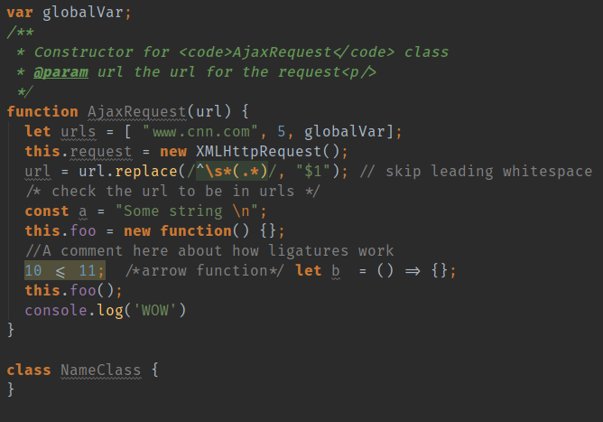|
| **Dark Visual Studio** | 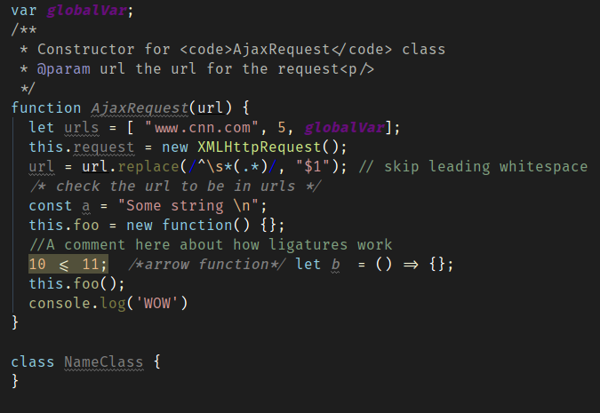|
| **Igor**  | 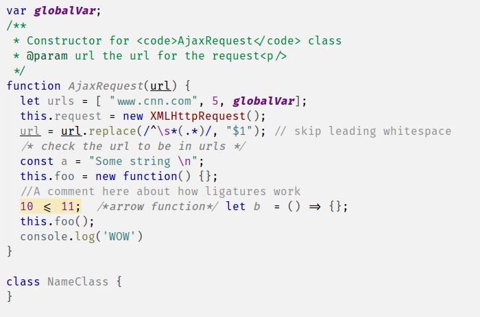|
| **Ladies Night** | 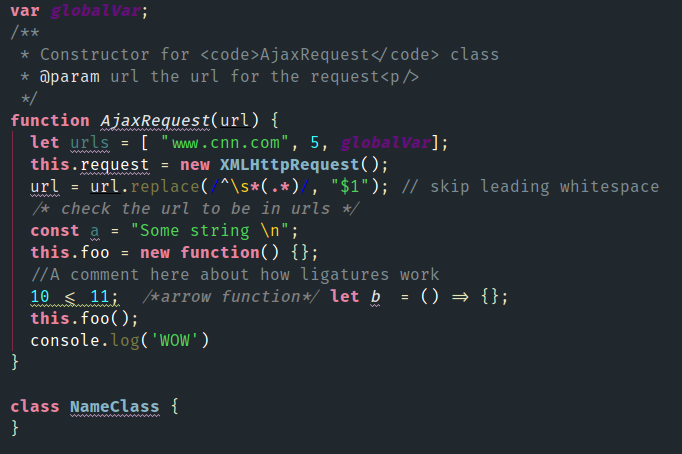|
| **Material Dark** |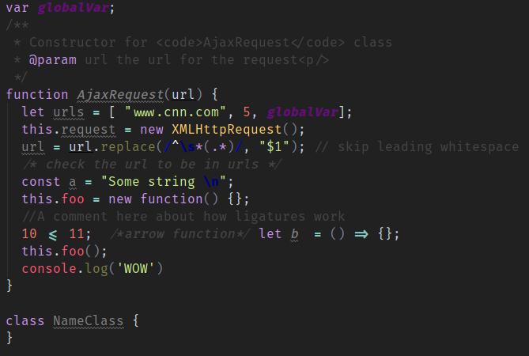|
| **Relax Your Eyes**  |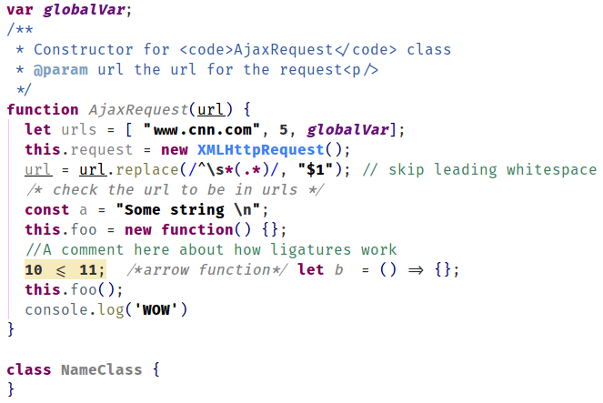|
| **Solarized Light Alt**  |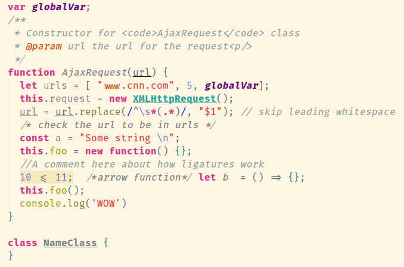|

## Fonts

### Java (Android Studio)

|Environment||
|---|---|
| **Language** | Java |
| **IDE** | Android Studio |
| **Color** | Solarized Light (Alt)|

| Font | Screenshot |
|--------------|------------|
|**Droid Sans Mono**  ||
|**Fira Code**  ||
|**Inconsolata**  ||
|**Hasklig**  ||
|**Monoid**  ||
|**Consolas**  ||
|**Ubuntu Mono**  ||

#### Javascript (Webstorm)

|Environment||
|---|---|
| **Language** | Javascript |
| **IDE** | Webstorm |
| **Color** | Darcula Large|

| Font | Screenshot |
|--------------|------------|
|**Fira Code**  |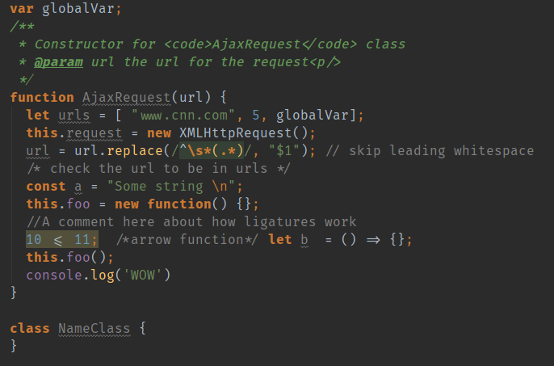
|**Anonymous Pro**  |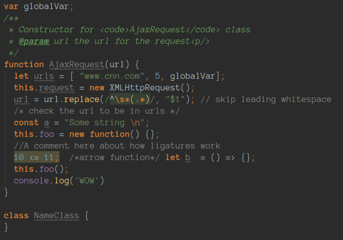
|**Hack**  |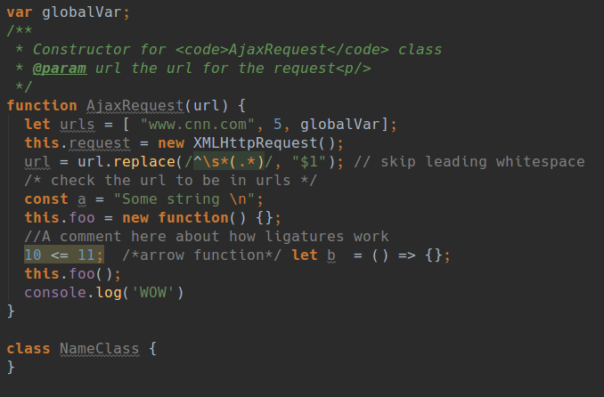
|**Hasklig**  |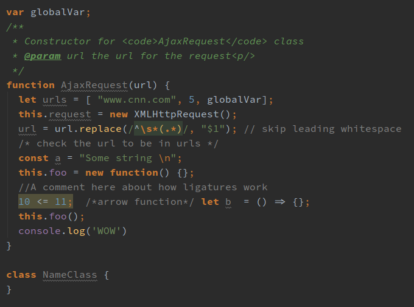
|**Input Mono**  |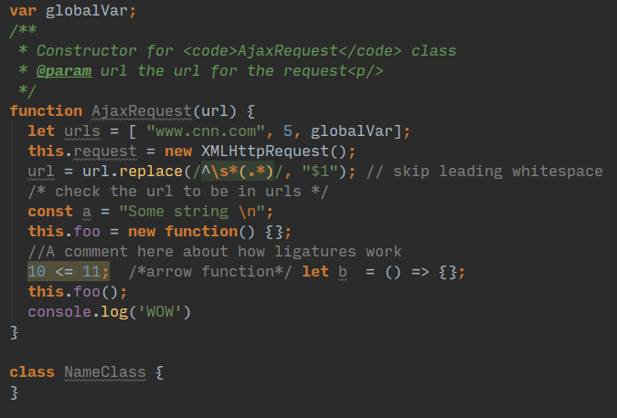
|**Input Mono Thin**  |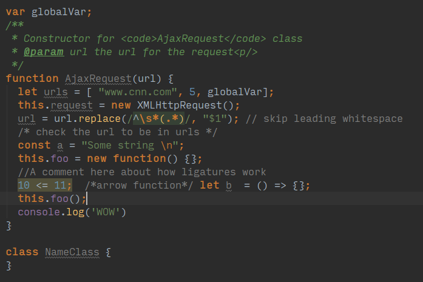
|**Ubuntu Mono**  |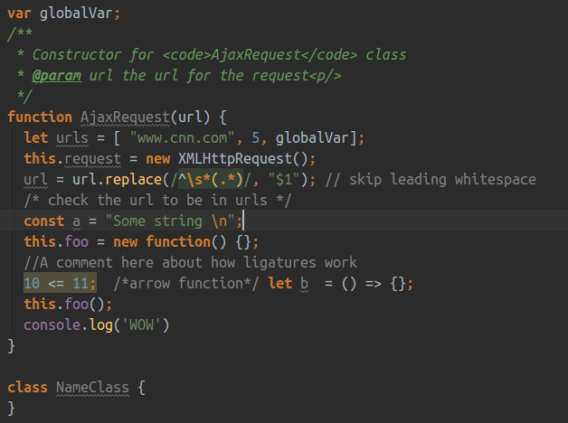

---

# Installation
## Installing Colors

### Linux
Copy to -

`~/.Webstorm2016.1/config/colors/`  
`~/.AndroidStudio2.2/config/colors/`  

### Mac
Copy to -

`~/Library/Preferences/Webstorm2016.1/config/colors/`  
`~/Library/Preferences/AndroidStudio2.2/config/colors/`  

### Windows
Copy to -

`C:/Users/<YOU>/Webstorm2016.1/config/colors/`  
`C:/Users/<YOU>/AndroidStudio2.2/config/colors/`  

## Installing Fonts

### Linux
Copy to -

`~/.local/share/fonts/`  (for you)  
`/usr/local/share/fonts/`  (for everyone)   

### Windows
Copy to -

`C:/Windows/Fonts`  

# Credits and References

### Color Themes
A great collection of color themes for Jetbrains IDEs can be found on http://color-themes.com/
Many of the themes here, were originally downloaded from **color-themes**, and tweaked to my liking.

### Font Squirrel
A highly recommended place to discover fonts is https://www.fontsquirrel.com/.  
You can specifically find monospaced fonts at https://www.fontsquirrel.com/fonts/list/classification/monospaced

### Programming Fonts
Another tumblr blog I follow a lot to know about awesome programming fonts is http://programmingfonts.org/ 
