# IntelliJ_Colors_Fonts

These are some color schemes and fonts I prefer to use in my IDEs. All the color schemes are fully compatible with - 
* PyCharm  
* WebStorm  
* PhpStorm  
* IntelliJ IDEA  
* Android Studio  

## Screenshots

### Color Schemes

#### Java (Android Studio)

**Darcula Large**  
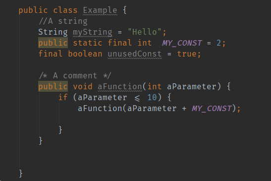

**Dark Visual Studio**  
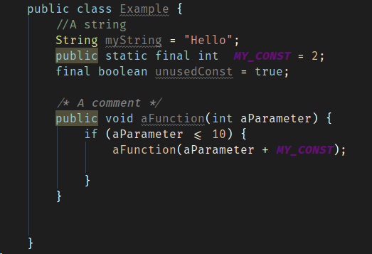

**Igor**  
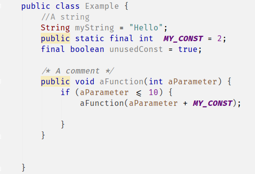

**Ladies Night**  
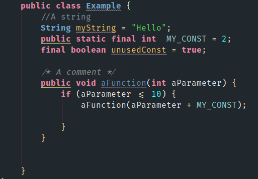

**Material Dark**  
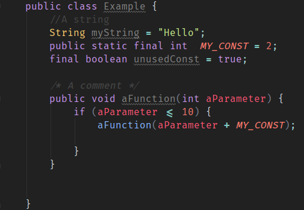

**Relax Your Eyes**  
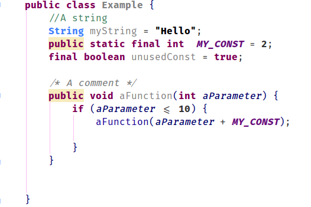

**Solarized Light Alt**  
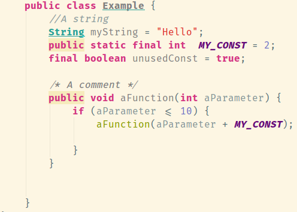

### Fonts

#### Java (Android Studio)

**Droid Sans Mono**  
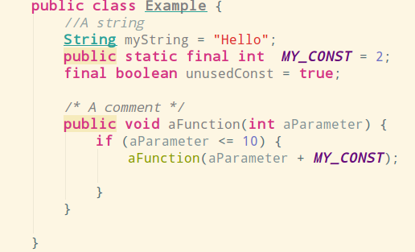

**Fira Code**  
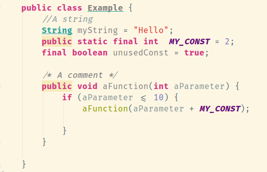

**Inconsolata**  
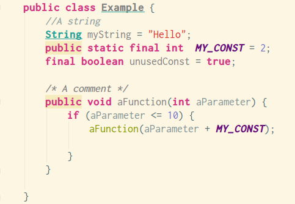

**Hasklig**  
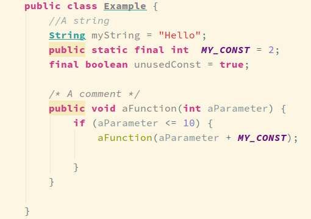

**Monoid**  
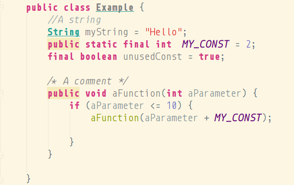

**Consolas**  
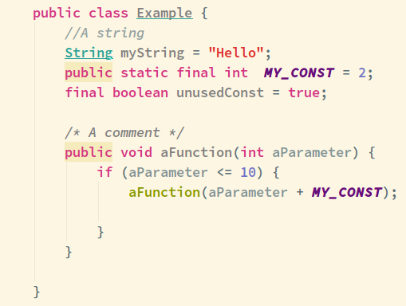

**Ubuntu Mono**  
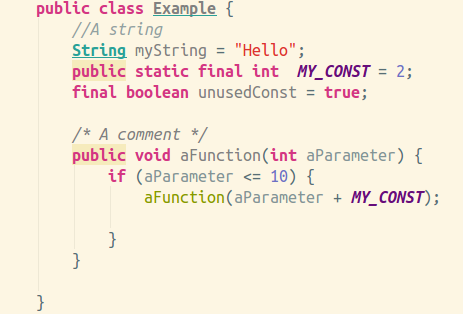

### Installing Colors

##### Linux
Copy to -

`~/.Webstorm2016.1/config/colors/`  
`~/.AndroidStudio2.2/config/colors/`  

##### Mac
Copy to -

`~/Library/Preferences/Webstorm2016.1/config/colors/`  
`~/Library/Preferences/AndroidStudio2.2/config/colors/`  

##### Windows
Copy to -

`C:/Users/<YOU>/Webstorm2016.1/config/colors/`  
`C:/Users/<YOU>/AndroidStudio2.2/config/colors/`  

### Installing Fonts

##### Linux
Copy to -

`~/.local/share/fonts/`  (for you)  
`/usr/local/share/fonts/`  (for everyone)   

##### Windows
Copy to -

`C:/Windows/Fonts`  
